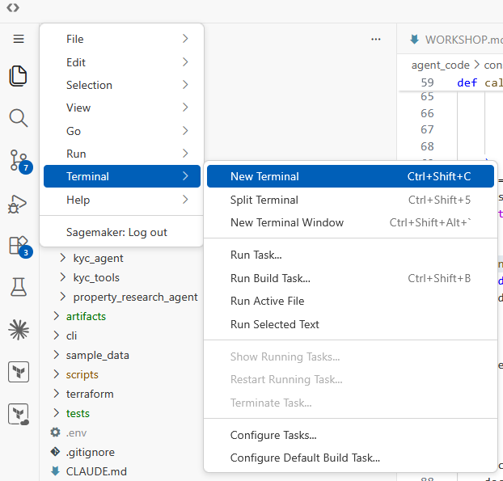
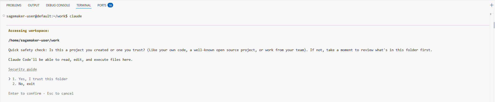
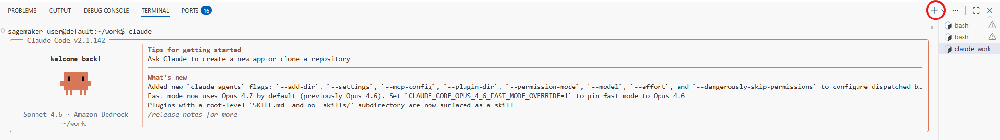
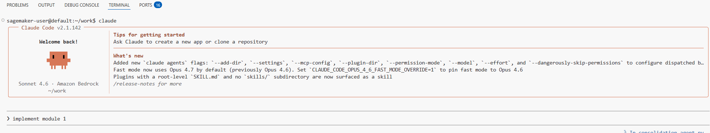
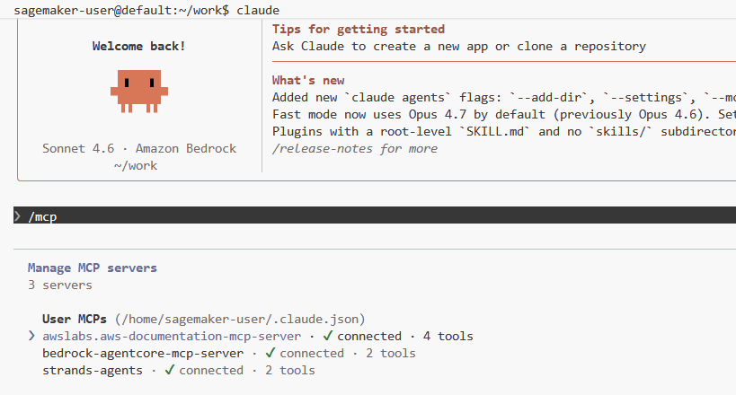
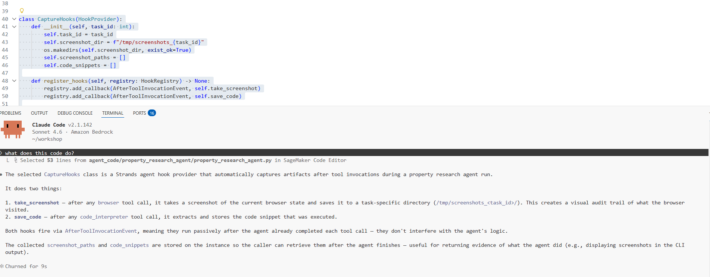

# Multi-Agent KYC Workshop

Build a multi-agent mortgage verification system using AWS Bedrock AgentCore. See [WORKSHOP.md](WORKSHOP.md) for the full architecture and module details.

## Quick Start

### 1. Open a Terminal

In VS Code, open a terminal (Terminal → New Terminal).



### 2. Launch Claude Code

```bash
claude
```

When prompted, confirm the directory is trusted.



### 3. Open a Second Terminal Tab

Click the `+` icon in the terminal panel to open a second tab. Use this for running tests, viewing files, and interacting with artifacts while Claude works in the first tab.



## Running the Workshop

In the Claude Code terminal, prompt the agent to implement each module in order:

```
Implement module 1
```



The agent will:
1. Run the setup script to copy scaffold code
2. Walk you through the implementation

After the agent completes the implementation you should do the following before moving to the next module:
- Review the code in the `agent_code/` and `terraform/` (after module 4) directories to see the changes
- Ask Claude any questions you have about the implementation or code
- Highlight any code snippet and ask "What does this do?" to get explanations of specific sections
- Review the module tests in the `tests/` directory (e.g., `tests/test_module_1.py`) to understand how the functionality is being validated
- In the second terminal tab, run the module tests using `make test_module_1` (replace with the appropriate module number) to ensure everything is working correctly before committing and moving on to the next module
- When ready, tell Claude that you have completed the module and are ready to move on to the next one


## Backup: Manual Scaffold Setup

If Claude Code or the Bedrock API is unavailable, you can copy each module's scaffold code directly using make targets — then return to Claude Code to continue exploring and asking questions once it's available.

In your second terminal tab:

```bash
make module_1   # copies scaffold into agent_code/consolidation_agent/
make module_2   # copies scaffold into agent_code/kyc_tools/
make module_3   # copies scaffold into agent_code/doc_extraction_agent/, kyc_agent/, property_research_agent/
make module_4   # copies scaffold into terraform/
make module_5   # copies scaffold into cli/
make module_7   # runs terraform destroy (cleanup)
```

After running the scaffold command, you can still run the tests:

```bash
make test_module_1
make test_module_2
# etc.
```

> **Note:** The scaffold commands copy working code; they don't replace the guided experience. Use this path only if there are issues with Claude Code.

## Tips & Tricks

### See Installed MCP Servers

Type `/mcp` in Claude Code to see the documentation MCP servers available for the workshop (AgentCore docs, Strands docs).
Press escape to exit the MCP view and return to the Claude Code terminal.



### Ask for Clarification

You can ask the agent to explain any concept at any time:

```
What does BedrockAgentCoreApp do?
```

```
How does the OAuth2 M2M flow work in this architecture?
```

```
Explain the FTS5 trigram query pattern
```

### Asking General Strands and AgentCore Questions
For general questions about using Strands or AgentCore, include a "use your MCP tools to answer" instruction in your prompt to get the most up-to-date information from the documentation MCP:

```
How do I convert my agent to use A2A protocol? Use your MCP tools to answer.
```

```
What security features does AgentCore Runtime offer? Use your MCP tools to answer.
```

### Explain Code in the IDE

Highlight any code snippet in the editor, then ask in Claude Code:

```
What does this do?
```



### Resuming Prior Sessions
If you need to resume a prior session, simply run `claude` again in the terminal and the use the `/resume` command to pick up where you left off.


### Run Tests Manually

In your second terminal tab, run module tests:

```bash
make test_module_1
make test_module_2
```

### View the Architecture

Open [WORKSHOP.md](WORKSHOP.md) in the editor — the Mermaid diagram renders inline with the installed extension.

## Cleanup

When you're done, run module 7 to destroy all AWS resources:

```
Implement module 7
```

Or manually:

```bash
cd terraform && terraform destroy -auto-approve
```
