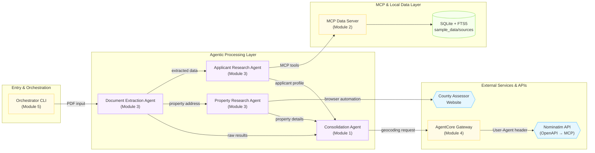

# Multi-Agent KYC Workshop

> **Quick Start:** See [README.md](README.md) for setup instructions and how to run the workshop.

> **Download Workshop Content:** You can use the link [here](https://ws-assets-prod-iad-r-iad-ed304a55c2ca1aee.s3.us-east-1.amazonaws.com/005d41ce-f501-4fd3-b9d2-5d2f5b2a946a/workshop_content_claude.tar.gz) to download the workshop materials.

## Use Case

A mortgage lender needs to verify applicants before approving a primary residence loan. The verification process requires:

1. Extracting applicant information from submitted documents (W2, pay stubs, driver's license, mortgage application)
2. Researching the applicant's credit history, income, property records, and liens
3. Verifying the subject property details via public records
4. Confirming the applicant's workplace is within 30 miles of the property (primary residence requirement)
5. Producing a consolidated risk assessment and recommendation

This workshop builds a multi-agent system that automates this entire pipeline using AWS Bedrock AgentCore.

## Architecture



**Data Flow:**

1. **CLI** receives a multi-page mortgage application PDF (mortgage form, W2, paystub, driver's license)
2. **Doc Extraction Agent** converts each PDF page to an image, classifies the document type using multimodal vision, and extracts structured fields (applicant name, work address, property address, income, etc.) via Pydantic models
3. **KYC Research Agent** takes the applicant name from the extracted mortgage application and queries the MCP server using fuzzy FTS5 search across credit reports, income verification, property records, and lien records — returning a consolidated background profile
4. **Property Research Agent** takes the property address and uses AgentCore Browser to navigate Clark County NV's assessor website, extracting ownership history, assessed value, and tax records. Runs asynchronously — the CLI polls for results using session pinning
5. **Consolidation Agent** receives all three outputs, geocodes both the work address and property address, calculates the haversine distance to verify the 30-mile primary residence requirement, then synthesizes everything into a risk assessment with an approve/deny/conditional recommendation
6. **CLI** displays each stage's results in Rich panels as they complete, saves property research artifacts (browser screenshots, code output) to a timestamped directory, and links to the AgentCore observability dashboard

## Modules

The modules will start off with local testing and development using `uvicorn` and the FastMCP server, then transition to deploying on AWS AgentCore runtimes in Module 4. The final two modules add enhancements and cleanup. 

**Be sure you explored the code and understand the core concepts in each module before moving to the next, as they build on each other.**

### Module 1: Consolidation Agent

**Objective:** Build the final decision-making agent that synthesizes all gathered data into a mortgage recommendation.

**Why start here?** Although the consolidation agent is the *last* step in the pipeline, it's the simplest agent — its primary job is to receive structured data from other agents and produce a risk assessment. Starting here allows us to validate the core business value immediately: can an AI agent produce a report that is genuinely useful to a human underwriter? By feeding it sample data directly, we prove the output format, reasoning quality, and decision logic before building the upstream data-gathering agents.

The consolidation agent receives outputs from the other three agents and uses two tools — `geocode_address` (Nominatim API) and `calculate_distance` (haversine formula) — to verify the applicant's work location is within 30 miles of the property. It produces a structured risk assessment with an approve/deny/conditional recommendation.

**Key concepts:** Strands Agent, BedrockAgentCoreApp entrypoint, custom Python tools with `@tool` decorator.

**Sample prompts to explore:**
- Explain what `BedrockAgentCoreApp` does and how the `@APP.entrypoint` decorator works
- Why use `BedrockAgentCoreApp` rather than building my own FastAPI app?
- Explain the haversine formula works in `calculate_distance`, is it appropriate for this usecase?
- How would I add a new tool such as a debt-to-income ratio check?

---

### Module 2: MCP Server

**Objective:** Build a Model Context Protocol (MCP) server that exposes KYC data as searchable tools.

**Why this next?** With the consolidation agent validated, we now need to feed it real data. The biggest challenge in KYC automation is integrating disparate data sources — credit bureaus, income databases, property registries, lien records — each with different schemas and access patterns. MCP provides a standard protocol for exposing data to agents as discoverable tools. By building the data layer first, we establish the integration pattern that research agents will consume in Module 3. This also demonstrates how existing databases can be made agent-accessible without rewriting application logic.

A custom FastMCP server backed by SQLite with FTS5 trigram indexes provides fuzzy text search across credit reports, income verification, property records, and lien records.

**Key concepts:** FastMCP, SQLite FTS5, MCP protocol, streamable-HTTP transport, read-only filesystem handling.

**Sample prompts to explore:**
- Why expose the queries as specific tools rather than giving the agent the ability to execute arbitrary SQL?
- Explain the FTS5 trigram tokenizer — how does fuzzy matching work in `query_fts`?
- How does FastMCP auto-generate the MCP tool schema from the function signature and docstring?
- What would need to change to add a new `search_tax_records` tool?
- What role does AgentCore play in this MCP server?

---

### Module 3: Research & Extraction Agents

**Objective:** Build three specialized agents that gather data for the consolidation agent.

**Why three separate agents?** Real-world KYC verification requires data from fundamentally different source types: structured documents (PDFs), internal databases (via MCP), and public websites (no API available). Each source type demands a different technical approach — multimodal vision for documents, MCP client for databases, and browser automation for websites. Separating these into specialized agents allows independent scaling, failure isolation, and parallel execution. It also mirrors how human underwriting teams divide work by specialty.

- **Document Extraction Agent** — Uses Strands multimodal input (`ContentBlock` with images) and Pydantic structured output to classify PDF pages (MortgageApplication, W2, PayStub, DriverLicense) and extract typed fields. This replaces manual data entry from submitted documents.
- **KYC Research Agent** — Connects to the MCP server via streamable-HTTP with OAuth2 M2M authentication. Discovers tools dynamically and queries applicant data using fuzzy matching. This demonstrates how agents consume the data integrations built in Module 2.
- **Property Research Agent** — Uses AgentCore Browser to navigate Clark County NV's assessor website and AgentCore Code Interpreter for calculations. Runs asynchronously with a poll-for-results pattern. This handles the common case where critical data exists only on public websites with no API — the agent navigates the site like a human would.

**Key concepts:** Multimodal vision, structured output, MCP client with OAuth2, AgentCore Browser, AgentCore Code Interpreter, async task pattern.

**Sample prompts to explore:**
- How does the two-pass classify-then-extract pattern work in the document extraction agent?
- Why does the KYC agent call `list_tools_sync()` at startup rather than hardcoding the tool list?
- Explain the async polling pattern in the property research agent, why return a `task_id` instead of blocking?
- What does `@requires_access_token` do and why is it needed for the KYC agent?
- How would the property research agent behave differently if the Clark County website changed its HTML structure?
- Why use `runtimeSessionId` when polling the property research agent?

---

### Module 4: Deploy

**Objective:** Deploy all agents and supporting infrastructure to AWS using Terraform.

**Why deploy now?** With all agents working locally, we move to production deployment to validate the full system under real conditions — cold starts, container networking, OAuth2 token flows, and cross-agent communication. Deployment also provisions shared infrastructure (memory, gateway) that Module 6 will use for enhancements.

Provisions the complete stack:
- Cognito User Pool + OAuth2 credential provider (agent-to-MCP authentication)
- ECR repositories + CodeBuild projects (Docker image builds)
- 5 AgentCore runtimes (one per agent/tool)
- AgentCore Gateway with Nominatim OpenAPI target (exposes geocoding API as MCP tools — no code required)
- AgentCore Memory resource (for session persistence in Module 6)
- S3 bucket, Secrets Manager, IAM roles

**Key concepts:** Terraform modules, AgentCore runtime deployment, Docker containerization, OAuth2 M2M flow, AgentCore Gateway, infrastructure as code.

**Sample prompts to explore:**
- What is unique about AgentCore runtime compared to standard container deployments on ECS or EKS?
- Explain the AgentCore runtime lifecycle configuration options
- How does the OAuth2 M2M flow work between the KYC agent and the MCP server?
- How would a user based OAuth2 flow differ in terms of token acquisition and runtime invocation?
- Does the deployed Agent assume the user's identity or does it have its own service role? What are the security implications of each approach?
- What does the AgentCore Gateway do? How does it turn an OpenAPI spec into MCP tools without any code?
- Why does the KYC agent runtime need `runtimeUserId` in the invocation but the consolidation agent doesn't?
- What IAM permissions does each runtime need and why?

---

### Module 5: CLI

**Objective:** Build a Python CLI that orchestrates the full pipeline and displays results.

**Why a CLI orchestrator?** In production, multi-agent systems need a coordination layer that handles sequencing, parallelism, error recovery, and user feedback. The CLI serves as this orchestrator — it demonstrates the invocation patterns, polling strategies, and result aggregation that would exist in any production frontend (web app, API gateway, or workflow engine). It also provides immediate visual feedback to validate the end-to-end pipeline works as a cohesive system, not just as isolated agents.

The CLI:
- Accepts a PDF path as argument
- Auto-fetches agent ARNs from Terraform outputs
- Invokes agents sequentially: extract → parallel research → consolidate
- Displays progress with Rich spinners and formatted panels
- Polls the async property research agent with session pinning
- Saves artifacts (replay GIF, code snippets) to a timestamped directory
- Links to the AgentCore browser console and observability dashboard

**Key concepts:** concurrent agent invocation, async polling, `runtimeSessionId` for container pinning, `runtimeUserId` for OAuth2 flows.

**Sample prompts to explore:**
- How does the CLI decide which agents to run in parallel vs. sequentially?
- What is `runtimeSessionId` used for and why does the property research polling depend on it?
- How would you modify the CLI to retry a failed agent invocation?
- What would need to change to turn this CLI into a REST API endpoint or a web application?

---

### Module 6: Enhancements

**Objective:** Refactor the consolidation agent to use MCP-based geocoding and add AgentCore Memory to all agents for regulatory compliance.

**Why enhance now?** With the full pipeline deployed and validated end-to-end, we can now improve the architecture without risk. Two enhancements address real production concerns:

1. **MCP Refactoring** — The consolidation agent's `geocode_address` tool is a Strands `@tool`-decorated Python function — tightly coupled to the framework and only usable by that specific agent. By switching to the AgentCore Gateway MCP endpoint, the same geocoding capability becomes framework-agnostic and reusable by any agent or MCP client, regardless of SDK or language.

2. **AgentCore Memory** — For regulatory compliance, all agent conversations must be persisted as an audit trail. AgentCore Memory provides short-term session storage that captures the full conversation history (user messages, tool calls, agent responses). The memory resource was already provisioned in Module 4.

**Key concepts:** MCP client refactoring, `@requires_access_token` for Gateway auth, `AgentCoreMemorySessionManager`, session persistence, adaptive retries for quota limits.

**Sample prompts to explore:**
- What are the different AgentCore Memory strategy types and when would you use each one?
- Why does each agent invocation get a new `session_id` instead of reusing one across calls?
- What's the difference between using a Strands `@tool` for geocoding vs. the AgentCore Gateway MCP endpoint?
- How would you query stored memory records to build a compliance audit report?

---

### Module 7: Cleanup

**Objective:** Destroy all workshop infrastructure.

Runs `terraform destroy` to remove all AWS resources created during the workshop.

## Testing

Each module has a test script in `tests/` that validates the agent against sample inputs and displays results in a Rich TUI. Tests auto-detect whether to run locally (uvicorn/FastMCP) or against deployed agents (AgentCore).

```bash
make test_module_1   # Consolidation agent
make test_module_2   # MCP server tools
make test_module_3   # Research agents (doc, KYC, property)
make test_module_4   # Deployment validation + health checks
make test_module_5   # CLI end-to-end pipeline
```

Override mode with `TEST_MODE=local` or `TEST_MODE=remote`.

## Prerequisites

- AWS account with Bedrock AgentCore access
- Terraform >= 1.5
- Python 3.12+ with `uv`
- AWS CLI configured with appropriate permissions
